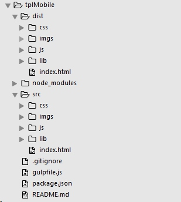
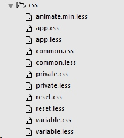
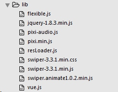

#tplMobile手机版模板介绍
>作为手机H5中制作的模板，作为手机页面制作的基础框架。

- - - - 
项目地址：<https://git.oschina.net/kermityu/tplMobile.git>
##项目结构介绍
项目：



scr目录下是项目的资源（开发文件）
- css项目的样式文件
    

```python
/*
Author:kermit
Email:455196886@qq.com
Company:http://dragontrail.com/
Creattime:2017-01-09
*/

//引入基础
@import "reset.less";
//引入动画类库
@import "animate.min.less";
//引入变量
@import "variable.less";
//引入公共
@import "common.less";
//引入项目私有库
@import "private.less";

```
- imgs项目图片资源
- js资源
- lisb项目的依赖资源


1. flexible.js
dist是项目的压缩文件（项目上线）

