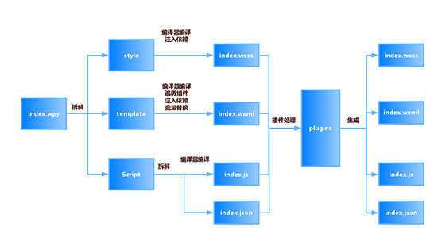

#微信开发小程序框架-wepy分享
WePY是组件化的快发小程序的框架，我在苏黎世旅游项目中运用了此框架。
个人感觉框架优势:
1. 使用自己熟悉的开发功能工具；
2. 组件化开发，方便复用，代码简介；
3. 可以使用预编译语言；
苏黎世旅游小程序项目地址：[http://git.dragongap.cn:10080/kermit/zurich-wxapp.git](http://git.dragongap.cn:10080/kermit/zurich-wxapp.git)
小程序二维码：


##WePY介绍：
>WePY 是一款让小程序支持组件化开发的框架，通过预编译的手段让开发者可以选择自己喜欢的开发风格去开发小程序。框架的细节优化，Promise，Async Functions的引入都是为了能让开发小程序项目变得更加简单，高效。

项目地址：[https://github.com/wepyjs/wepy](https://github.com/wepyjs/wepy)
官方文档：[https://wepyjs.github.io/wepy/](https://wepyjs.github.io/wepy/)
资源汇总:  [https://github.com/aben1188/awesome-wepy](https://github.com/aben1188/awesome-wepy)
框架原理解析:[深入wepy小程序组件化框架](http://www.imhjm.com/article/5977ebab7dd03248a2e8d57f)
###wepy特征
- 类Vue开发风格
- 支持自定义组件开发
- 支持引入NPM包
- 支持Promise
- 支持ES2015+特性，如Async Functions
- 支持多种编译器，Less/Sass/Styus、Babel/Typescript、Pug
- 支持多种插件处理，文件压缩，图片压缩，内容替换等
- 支持 Sourcemap，ESLint等
- 小程序细节优化，如请求列队，事件优化等
###安装使用:
安装（更新） wepy 命令行工具。
```python
npm install wepy-cli -g
```
生成开发示例
```python
wepy new myproject
```
开发实时编译
```python
wepy build --watch
```
开发者工具使用
- 使用微信开发者工具新建项目，本地开发选择dist目录。
- 微信开发者工具-->项目-->关闭ES6转ES5。重要：漏掉此项会运行报错。
- 微信开发者工具-->项目-->关闭上传代码时样式自动补全 重要：某些情况下漏掉此项会也会运行报错。
- 微信开发者工具-->项目-->关闭代码压缩上传 重要：开启后，会导致真机computed, props.sync 等等属性失效。
- 项目根目录运行wepy build --watch，开启实时编译。

更详细参考: [WePY项目的创建与使用](https://wepyjs.github.io/wepy/#/?id=wepy%e9%a1%b9%e7%9b%ae%e7%9a%84%e5%88%9b%e5%bb%ba%e4%b8%8e%e4%bd%bf%e7%94%a8)
###wepy使用准备的基础知识
- [微信小程序官方文档](https://mp.weixin.qq.com/debug/wxadoc/dev/)
- ES6/7的一些语法，[ECMAScript 6 入门](http://es6.ruanyifeng.com/)
- 借鉴vue.js,先阅读[Vue官方文档](https://cn.vuejs.org/v2/guide/)了解相关概念
##wepy中一些概念的理解
###.wpy文件说明
`.wpy`文件的编译过程过下：


1. 脚本部分，即`<script></script>`标签中的内容，又可分为两个部分:
&emsp;&emsp;&emsp;&emsp;逻辑部分，除了config对象之外的部分，对应于原生的`.js`文件；
&emsp;&emsp;&emsp;&emsp;配置部分，即config对象，对应于原生的`.json`文件。
2. 结构部分，即`<template></template>`模板部分，对应于原生的`.wxml`文件。
3. 样式部分，即`<style></style>`样式部分，对应于原生的`.wxss`文件。

 其中，小程序入口文件`app.wpy`不需要`template`，所以编译时会被忽略。`.wpy`文件中的`script`、`template`、`style`这三个标签都支持`lang`和`src`属性，`lang`决定了其代码编译过程，`src`决定是否外联代码，存在`src`属性且有效时，会忽略内联代码。
各标签对应的`lang`值如下表所示：
```table
| 标签       | lang默认值 | lang支持值                      |
| style    | `css`   | `css`、`less`、`sass`、`stylus` |
| template | `wxml`  | `wxml`、`xml`、`pug(原jade)`    |
| script   | `babel` | `babel`、`TypeScript`         |
```
###App实例、Page页面实例、Component组件实例比较
```table
| 标签 | 类型 | App | Page | Component |参数说明 |
| globalData|Object|√|-  |-|全局数据对象|
| onLaunch|Function|√|-  |-|小程序初始化|
| config|Object|√|√ |-|对应.json 文件|
| customData|Object|√|√  |√|自定义数据|
| customFunctio|Function|√|√  |√|自定义函数|
|onLoad|Function|-|√|√|加载事件|
|onShow|Function|√|√|-|显示事件|
|onRoute|Function|-|√|-|显示事件|
|onReady|Function|-|√|√|只有在页面路由时才会触发|
|onHide|Function|√|√|-|隐藏事件|
|onUnload|Function|-|√|√|卸载事件|
|data|Object|-|√|√|所需数据|
|components|Object|-|√|√|引用的组件|
|mixins|Arry|-|√|√|引用的Mixin实例|
|computed|Object|-|√|√|声明计算属性|
|watch|Object|-|√|√|声明数据watcher|
|methods|Object|-|√|√|只用于声明页面模板中标签的bind、catch事件|
|events|Object|-|√|√|声明组件之间的事件处理函数|
```
!!!注意，对于WePY中的methods属性，因为与Vue中的使用习惯不一致，非常容易造成误解，这里需要特别强调一下：WePY中的methods属性只能声明页面wxml标签的bind、catch事件，不能声明自定义方法，这与Vue中的用法是不一致的。
更多关于参考文档:
- [注册程序APP](https://mp.weixin.qq.com/debug/wxadoc/dev/framework/app-service/app.html)
- [注册页面Page](https://mp.weixin.qq.com/debug/wxadoc/dev/framework/app-service/page.html)
- [为什么需要onRoute函数?](https://github.com/wepyjs/wepy/wiki/%E4%B8%BA%E4%BB%80%E4%B9%88%E9%9C%80%E8%A6%81onRoute%E5%87%BD%E6%95%B0%3F)
- [WePY 使用less autoprefix](https://github.com/wepyjs/wepy/wiki/WePY-%E4%BD%BF%E7%94%A8less-autoprefix)
- [wepy项目中使用async await](https://github.com/wepyjs/wepy/wiki/wepy%E9%A1%B9%E7%9B%AE%E4%B8%AD%E4%BD%BF%E7%94%A8async-await)
- [wepy项目中使用Promise](https://github.com/wepyjs/wepy/wiki/wepy%E9%A1%B9%E7%9B%AE%E4%B8%AD%E4%BD%BF%E7%94%A8Promise)
- [升级指南](https://github.com/wepyjs/wepy/wiki/%E5%8D%87%E7%BA%A7%E6%8C%87%E5%8D%97)

##wepy组件
原生小程序支持js模块化，但彼此独立，业务代码与交互事件仍需在页面处理。无法实现组件化的松耦合与复用的效果。
在WePY中实现了小程序的组件化开发，组件的所有业务与功能在组件本身实现，组件与组件之间彼此隔离，上述例子在WePY的组件化开发过程中，A组件只会影响到A所绑定的myclick，B也如此。
- [普通组件引用](https://wepyjs.github.io/wepy/#/?id=%e6%99%ae%e9%80%9a%e7%bb%84%e4%bb%b6%e5%bc%95%e7%94%a8)-——swpiwerBanner组件的引用
- [组件的循环渲染](https://wepyjs.github.io/wepy/#/?id=%e7%bb%84%e4%bb%b6%e7%9a%84%e5%be%aa%e7%8e%af%e6%b8%b2%e6%9f%93)—— icon组件的渲染
- [computed 计算属性](https://wepyjs.github.io/wepy/#/?id=computed-%e8%ae%a1%e7%ae%97%e5%b1%9e%e6%80%a7)——

##推荐wepy插件
- [wepy-weui-demo](https://github.com/wepyjs/wepy-weui-demo)WeUI in WePY
>[WeUI](https://github.com/Tencent/weui-wxss) 是一套同微信原生视觉体验一致的基础样式库，由微信官方设计团队为微信内网页和微信小程序量身设计，令用户的使用感知更加统一。 这里是 WeUI 在 WePY 中的使用示例。
- [wepy-login_relogin-component](https://github.com/aben1188/wepy-login_relogin-component)小程序登录及二次重新登录组件
>用于小程序登录及二次登录，尤其是在用户首次登录时拒绝的情况下，允许用户随时进行二次重新登录；而不是像目前很多小程序在用户首次登录时拒绝了的情况下无法直接发起二次重新登录，而是要求用户进行下面的一系列繁琐操作：退出该小程序、重新进入小程序列表、在小程序列表中删除该小程序、重新搜索该小程序、再次打开该小程序、弹出登录窗口时允许登录。显然这样的体验极差，而该组件可大幅简化二次重新登录流程，提升用户体验。

- [wepy-com-swiper ](https://github.com/dlhandsome/wepy-com-swiper)微信小程序触摸内容滑动解决方案
  - 丰富的事件回调
  - 丰富的属性
  - 支持横、纵向滑动
  - 强拓展（可在原插件基础上二次开发）
- 

